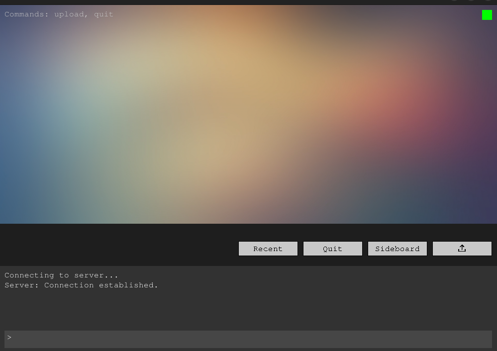
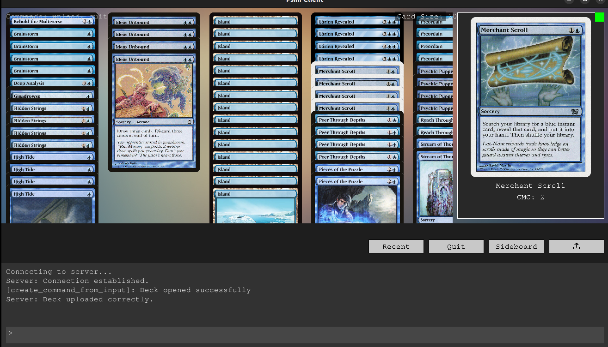
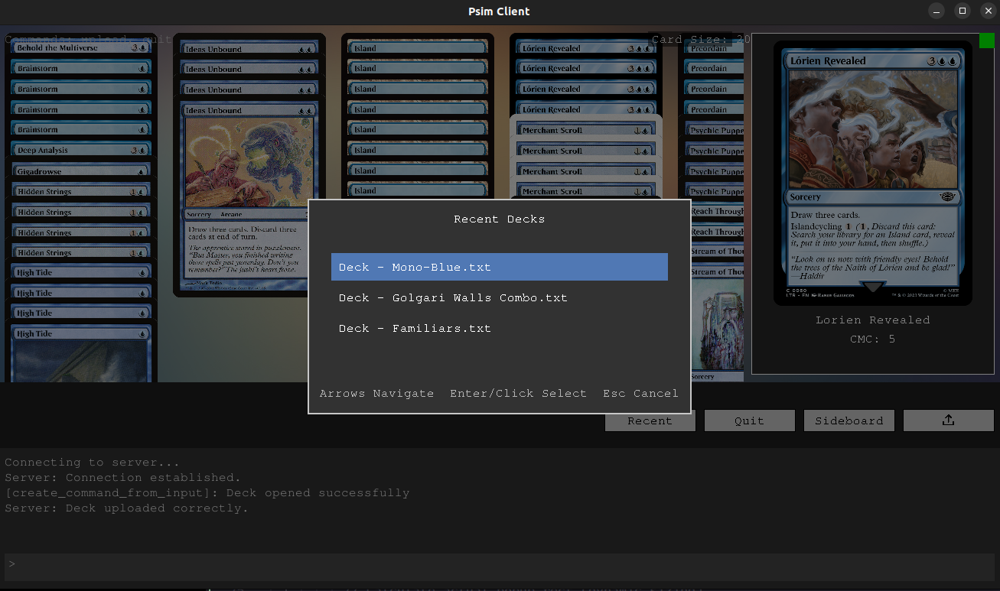

# About the project
The core idea is to write a MTGO (Magic The Gathering Online) clone to play for free with your friends online.\
It has to be really simple: you upload a deck, connect to a server and play.\
I started this project also to learn SDL and C++ async programming.\
The original plan was to start with [pauper](https://www.mtggoldfish.com/metagame/pauper#paper) staples to reduce the workload, with the option to expand later.\
If you look at it carefully, it is an ambitious project. It requires deep knowledge of [SDL](https://wiki.libsdl.org/wiki/index) programming, C++ multithreading, sockets with async operations, networking and last but not least [MTG rules](https://media.wizards.com/2025/downloads/MagicCompRules%2020250725.pdf).\
Feel free to contribute.

# Other similar projects
+ https://cockatrice.github.io/
+ https://xmage.today/
  
# Required libraries
+ libboost-all-dev
+ nlohmann-json3-dev
+ libcurl4-openssl-dev    
+ libsdl2-ttf-dev

# Quick load deck demo
Still working on clients loading decks.
Compile (for now only under Linux) with
```
make clean all
```
then run a server with
```
./server_app
```
Run a sample client with:
```
./client_app
```
You can use the buttons to upload a deck, toggle the sideboard visualization, or upload a recent deck.





# Features to add
## Deck visualizer
+ Add the possibility of dragging cards around;
+ Don't re-initialize columns for sideboard view toggle for faster switch;
+ Add a "ready to play" button;
