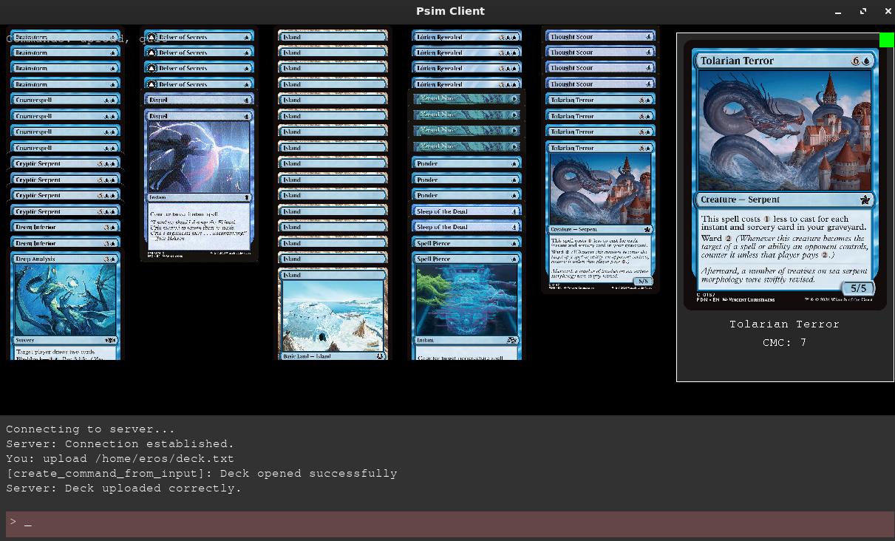

# Required libraries
+ libboost-all-dev
+ nlohmann-json3-dev
+ libcurl4-openssl-dev    
+ libsdl2-ttf-dev

# Quick load deck demo
Still working on clients loading decks.
Compile with
```
make clean all
```
then run a server with
```
./server_app
```
Run a sample client with:
```
./client_app
```
then use "upload <path>" in the command window to upload a sample deck and trigger a deck
visualization demo.


